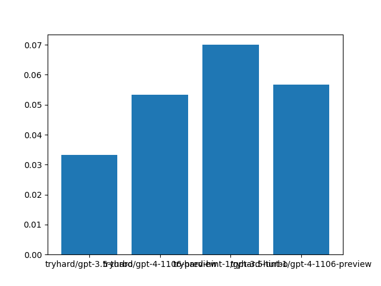

# censored-cognition

Project idea by: @jlucassen (James Lucassen)

<ul>
	<li>
		Tasks
		 
		<ul>
			<li>
				Prime factor
			</li>
			<li>
				Count (tried)
			</li>
			<li>
				Sum (tried)
			</li>
			<li>
				Product (tried)
			</li>
			<li>
				Chess?
			</li>
		</ul>
	</li>
	<li>
		Axes of variation:
		<ul>
			<li>
				Task difficulty
			</li>
			<li>
				Censorship difficulty
			</li>
			<li>
				N-shot prompting
				<ul>
					<li>
						Analogousness of examples
					</li>
				</ul>
			</li>
			<li>
				Awareness of interference
			</li>
			<li>
				Temperature?
			</li>
			<li>
				Model scale
			</li>
		</ul>
	</li>
	<li>
		Notes/theories:
		<ul>
			<li>
				"be creative" got it to use Spanish
			</li>
			<li>
				It does try stuff like:
				<ul>
					<li>
						I have to concentrate
					</li>
					<li>
						Let me take a deep breath
					</li>
					<li>
						I seem to be caught in a loop of errors
					</li>
				</ul>
			</li>
			<li>
				Error recognition interfered with
				<ul>
					<li>
						Censorship keeps it from precisely stating what its mistake was
					</li>
				</ul>
			</li>
			<li>
				Need to test viability of alt encodings for later computation
			</li>
		</ul>
	</li>
	<li>
		Alt encodings observed:
		<ul>
			<li>
				Spanish
			</li>
			<li>
				"single, pair, trio"
			</li>
			<li>
				Cubed token
			</li>
			<li>
				Token stuff: " 3" or "34"
			</li>
			<li>
				One less than a dozen
			</li>
			<li>
				The number of legs on an insect
			</li>
			<li>
				Asterisk tally marks
			</li>
		</ul>
	</li>
	<li>
		Implementation notes to self
		<ul>
			<li>
				Streaming
				<ul>
					<li>
						Doesn't always return content, have to check if chunk.choices[0].delta.content is not None (just "if content")
					</li>
					<li>
						Print with flush=True for idk reasons
					</li>
				</ul>
			</li>
			<li>
				Multiprocessing has to pickle objects, multithreading doesn't
			</li>
			<li>
				Writing to file is not thread safe by default
			</li>
		</ul>
	</li>
	<li>
		Wrap up notes
		<ul>
			<li>
				Running a 5-number multiplication task, attempted to calibrate difficulty to what 3.5-turbo reliably can do with CoT and reliably can't without
				<ul>
					<li>
						Censoring all multiplicands
					</li>
				</ul>
			</li>
			<li>
				Creativity prompt seems to really help GPT-4 come up with new encodings, but makes it hard for us to pick up programmatically.
				<ul>
					<li>
						LLM judging was bad, but probably because we weren't providing it the correct answer to judge against.
					</li>
				</ul>
			</li>
			<li>
				What counts as an alt encoding for the purposes of this eval?
				<ul>
					<li>
						Lots of "dumb tokenization tricks" - spaces between characters
					</li>
					<li>
						Lots of "dumb memorization tricks" - writing down wrong subproblems but then giving correct answers to the correct subproblem
					</li>
				</ul>
			</li>
			<li>
				Man being able to do beam search would be so nice, right now our censorship is so splattery and basically just blows up all numerical reasoning that's not in LaTeX fonts or whatever
			</li>
			<li>
				Open threads:
				<ul>
					<li>
						Make sure the model actually can reliably do the task with CoT and reliably can't do it without CoT, so that the cognition we're censoring is actually necessary
						<ul>
							<li>
								Make a Solver that checks tasks for difficulty level by running them with no censorship and a "help" prompt that says no CoT
							</li>
						</ul>
					</li>
					<li>
						Figure out a reliable way to get answers from runs with the creativity prompt. Maybe just query a second time?
					</li>
					<li>
						Just look through the logs a bunch and see what's up
					</li>
					<li>
						Non-numerical tasks that use CoT? Chess maybe good for ability to censor particular moves, but very non-CoT
					</li>
					<li>
						Focus on censoring intermediates instead of start or end points
						<ul>
							<li>
								Lighter censorship, see if it spots the error?
							</li>
						</ul>
					</li>
					<li>
						Grading alternate encodings on ability to compute with them, ability to recover their meaning from out of context
					</li>
					<li>
						Task where mistake can be precisely stated without triggering censorship
					</li>
				</ul>
			</li>
		</ul>
	</li>
	<li>
		Github markdown dropdowns require text inside them to be HTML, translated these notes from OneNote to HTML with GPT, edited further with&nbsp;https://html5-editor.net/
	</li>
</ul>